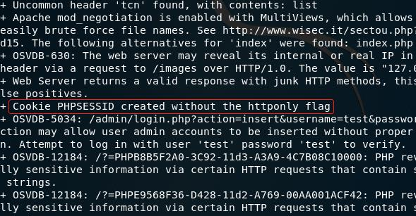

跨站脚本攻击（XSS）

#### 实验过程：

下载iso文件

虚拟机配置网课Host-Only

使用虚拟机IP地址访问该漏洞网站

设置虚拟机密码

##### 查看密码：

浏览器特性导致，firefox与chrome是默认这样的。IE8默认不会。其他的不关心不测试。
 浏览器在用户登录时，会提示用户是否记住[密码](https://www.webshell.cc/tag/mima)：
 1、对于firefox，用户有三个选择：记住、不记录本站、暂不。

2、对于chorme，用户只有在输入正确[密码](https://www.webshell.cc/tag/mima)登录成功后，才会出现提示：“想让谷歌浏览器保存您的[密码](https://www.webshell.cc/tag/mima)吗？”，用户有两个选择：保存密码、此站一律不保存密码。

3、而当在“自动完成”设置里开启IE8的“表单上的用户名和密码”功能时，IE8会在用户登录时弹窗提醒是否记住。

其实这些都是类似于普通的表单自动完成功能，不过又不太一样。

最关键的一点在于密码是“顶级”隐私信息，浏览器会专门有一个[安全](https://www.webshell.cc/tag/security)策略来保护记住的密码。

比如不像普通表单那样可以在不同的域共享表单信息。

在Web层面上，既然不可能违背同源策略，那要攻击，只有考虑XSS这样的方法。XSS此时威力无穷。

这三个浏览器安全策略有点差异，比较有意思。先来看firefox。登录后出现的提醒，很多人为了方便都会选择“记住”：

如果退出后，浏览器会记住用户名与密码

当包含用户名密码的表单被渲染后，浏览器会自动填充值，密码是星号显示，直接查看源码是看不到的。

但却可以通过DOM操作来获取到星号密码的值，比如简单的这样测试，在浏览器地址栏上输入：

```
javascript:alert(document.getElementsByTagName('form')[0].getElementsByTagName('input')[1].value);
```

而在实际攻击中，如果有XSS漏洞的话，简单的POC需要这样：

```
window.onload=function(){
alert(document.getElementsByTagName('form')[0].getElementsByTagName('input')[1].value);
```

在实际攻击中，用户如果是登录状态，则可以采用CSRF让用户退出登录，再执行攻击。上面这个TIP，在一定程度上可以让我们的最终攻击效果更好。chrome浏览器与firefox半斤八两，不说。IE8在这方面的设计就好些了。因为即使IE8记住了你的用户名与密码，但是在整个页面渲染后，IE8不会直接填充相应的用户名密码表单项。而需要用户先键入用户名，焦点出现在密码表单项时，才会显示出星号密码。但是也许这样可以继续：

```
javascript:alert(document.getElementById('username').value='admin');document.getElementById('password').focus();
```

普通用户获得admin权限：



##### 总结：

可以试着给表单多加一个项或少一个项，不同浏览器存在很多差异。