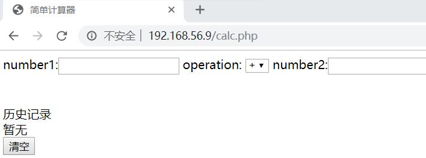

### 建立静态网页HTML

#### 实验要求：

1.使用flask

```
from flask import Flask, render_template
app = Flask(__name__)
@app.route('/')
def hello():
    return "Hello World!"
if __name__ == "__main__":
    app.run(host = "192.168.56.9", port = 80)
```

可在返回包李看到Hello World！

#### 简单的计算器：

```
<!DOCTYPE html>
<html lang="en">
<head>
    <meta charset="UTF-8">
    <title>简单计算器</title>
</head>
<body>
<form action="" method="get">
number1:<input type="text" name="num1">
operation:
<select name="op">
<option value="+">+</option>
<option value="-">-</option>
<option value="*">*</option>
</select>
number2:<input type="text" name="num2">
<input type="submit" value="submit">
</form>
<?php
    // 判断是否submit
    if(isset($_GET["num1"]) && isset($_GET["num2"]))
    {
        if(!is_numeric($_GET["num1"]) || !is_numeric($_GET["num2"])){
        echo "One of the input is not number!";
        }
        else{
            echo "Answer: ";
            if($_GET['op']=='+'){
                echo $_GET["num1"]+$_GET["num2"];
            }
            if($_GET['op']=='-'){
                echo $_GET["num1"]-$_GET["num2"];
            }
            if($_GET['op']=='*'){
                echo $_GET["num1"]*$_GET["num2"];
            }
        }
    }
?>
</body>
</html>
```

#### 数据库的使用

1.在数据库存储历史计算

```
$connect = mysqli_connect('localhost','yanhui','Kali','calc');
    if(!$connect){
        die("Connected failed:".mysqli_connect_error());
    }
$sql = "INSERT INTO hisans VALUES('".$_GET["num1"]."','".$_GET["num2"]."','".$_GET["op"]."','".$ans."')";
    if(!mysqli_query($connect, $sql))
        echo "<br>Error:".$sql."<br>".mysqli_error($connect);
mysqli_close($connect);
```

2.读取历史记录

```
<?php
$connect = mysqli_connect('localhost','yanhui','Kali','calc');
if(!$connect){
    die("Connected failed:".mysqli_connect_error());
}
$sql = "select * from hisans";
$res = mysqli_query($connect, $sql);
echo "<br>历史记录<br>";
if(mysqli_num_rows($res) > 0)
{
    while($row = mysqli_fetch_assoc($res))
    {
        echo $row['num1'].$row['op'].$row['num2'].'='.$row['ans'].'<br>';
    }
}
else echo "暂无<br>";
mysqli_close($connect);
?>
```

3.清空历史记录

```
<button onclick="clear();reload();">清空</button>
<script type="text/javascript">
    function clear(){
        <?php
        $connect = mysqli_connect('localhost','yanhui','Kali','calc');
        if(!$connect){
            die("Connected failed:".mysqli_connect_error());
        }
        $sql = "DELETE from hisans";
        if(!mysqli_query($connect, $sql))
            echo "<br>Error:".$sql."<br>".mysqli_error($connect);
        mysqli_close($connect);
        ?>
    }
    function reload()
    {
        location.href='calc.php';   //刷新页面
    }
</script>
```

最终结果：

