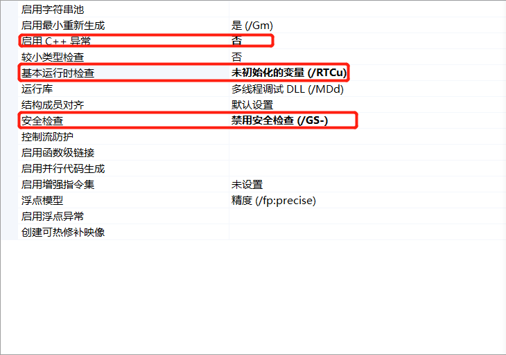
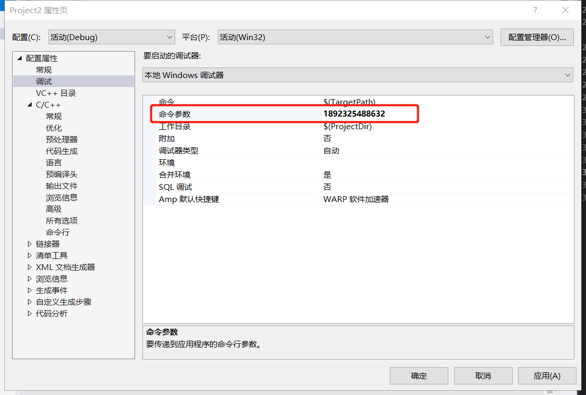
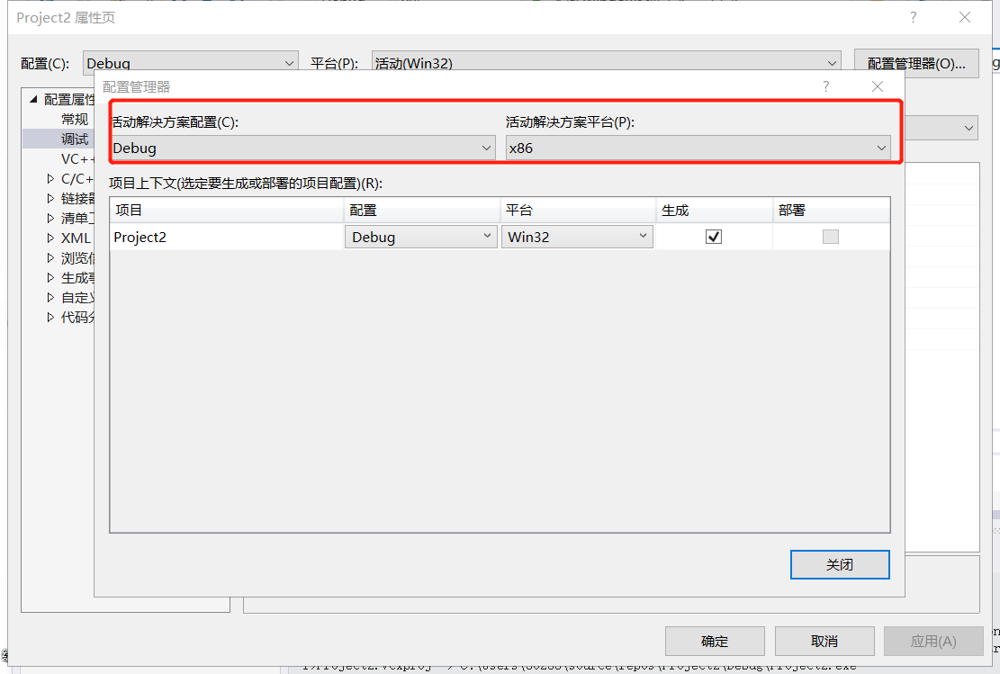

### 缓冲区溢出
#### *概述*:
缓冲区是内存中存放数据的地方。在程序试图将数据放到及其内存中的某一个位置的时候，因为没有足够的空间就会发生缓冲区溢出。


#### *实验代码*

```
#define CRT_SECLRE_NO_WARNINGS
//定义宏，删掉的话不能通过
#include<stdlib.h>
#include<stdio.h>
#include<string.h>
int sub(char* x)
{
    char y[10];
    strcpy(y,x);//安全性问题
    return 0;
}
int main(int argc,char** argv)
{
    if(argc>1)
        sub(argv[1]);
    printf("exit");
}
```

#### 实验过程：

1、属性→编译链接选项"C/C++"→代码生成→启用C++异常【关闭】
基本运行时检查【关闭】
安全检查【禁用】

2、所有选项→sdl检查【否】

3、调试→命令行参数→输入长字符串（中间不能有空格）

4、重新生成程序，把配置设置为debug,x86
