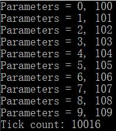

 

创建线程

```
#include <windows.h>
#include <tchar.h>
#include <strsafe.h>

#define MAX_THREADS 10	//创建的线程数
#define BUF_SIZE 255
#define MULTI_THREAD

DWORD WINAPI MyThreadFunction(LPVOID lpParam);

// Sample custom data structure for threads to use.
// This is passed by void pointer so it can be any data type
// that can be passed using a single void pointer (LPVOID).
typedef struct MyData {
	int val1;
	int val2;
} MYDATA, * PMYDATA;

// 支持unicode, main函数的别名
int _tmain()
{
	PMYDATA pDataArray[MAX_THREADS];
#ifdef MULTI_THREAD
	DWORD   dwThreadIdArray[MAX_THREADS];
	HANDLE  hThreadArray[MAX_THREADS];
#endif

	// Create MAX_THREADS worker threads.

	DWORD start = GetTickCount();
	//The return value is the number of milliseconds that have elapsed since the system was started.

	for (int i = 0; i < MAX_THREADS; i++)
	{
		// Allocate memory for thread data.

		pDataArray[i] = (PMYDATA)malloc(sizeof(MYDATA));

		if (pDataArray[i] == NULL)
		{
			// If the array allocation fails, the system is out of memory
			// so there is no point in trying to print an error message.
			// Just terminate execution.
			ExitProcess(2);
		}

		// Generate unique data for each thread to work with.

		pDataArray[i]->val1 = i;
		pDataArray[i]->val2 = i + 100;

		// Create the thread to begin execution on its own.

#ifdef MULTI_THREAD

		hThreadArray[i] = CreateThread(
			NULL,                   // default security attributes
			0,                      // use default stack size  
			MyThreadFunction,       // thread function name
			pDataArray[i],          // argument to thread function 
			0,                      // use default creation flags 
			&dwThreadIdArray[i]);   // returns the thread identifier 

		// Check the return value for success.
		// If CreateThread fails, terminate execution. 
		// This will automatically clean up threads and memory. 

		if (hThreadArray[i] == NULL)
		{
			printf("CreateThread Error(%d)", GetLastError());
			ExitProcess(3);
		}
#else
		MyThreadFunction(pDataArray[i]);
#endif
	} // End of main thread creation loop.

	// Wait until all threads have terminated.
	// TRUE表示所有都要执行完毕才返回, FALSE只要有任意一个执行完毕就返回
    // INFINTE 无限等待
#ifdef MULTI_THREAD
	WaitForMultipleObjects(MAX_THREADS, hThreadArray, TRUE, INFINITE);
#endif

	DWORD end = GetTickCount();
	printf("tick count: %d\n", end - start);

	// Close all thread handles and free memory allocations.
#ifdef MULTI_THREAD

	for (int i = 0; i < MAX_THREADS; i++)
	{
		CloseHandle(hThreadArray[i]);
		if (pDataArray[i] != NULL)
		{
			free(pDataArray[i]);
			pDataArray[i] = NULL;    // Ensure address is not reused.
		}
	}
#endif
	return 0;
}

DWORD WINAPI MyThreadFunction(LPVOID lpParam)
{
	PMYDATA pDataArray;
	pDataArray = (PMYDATA)lpParam;
	Sleep(1000);
	//人为加长时间, 并发与串行间的区别更明显
	printf("Parameters = %d, %d\n", pDataArray->val1, pDataArray->val2);
	return 0;
}
```

并发执行，多线程：

如果我们把上面线程并发执行的过程抽象成上厕所的话，就一个马桶，很多个人在外面排队，如果两个或者多个人程同时上一个厕所，就很容易出现问题，这种线程是不安全的。要解决问题只需要在门上安一把锁，必须等上一个人解决了下一个人才能进入，要解决的一个一个来。（扩展一下，会不会有一直解决不了的情况呢？会，比如当一个线程a在A厕所中执行线程，线程b等a解决完了才能进入A厕所，而a执行过程中要调用B厕所，而B厕所正好有人在里面了，这个人正好是B。这样的话，线程A永远结束不了，就出现了死锁问题）

我们解决上述问题的方法就是加个对象锁，对象锁有0和1两种状态，默认情况为1，代表厕所里没人，线程可以进入。一旦线程进入，她就会变成0---有人的状态，其他线程不能进入，不能进入的线程会进入线程等待池中（blocked阻塞状态）。任何对象都可以充当对象锁，一般用this充当对象锁。

串行执行，单线程：

注释宏

```
#define MULTI_THREAD
```

然后编译运行代码, 可得以下结果: 

实验结论：

其实也可以使用join接口可以解决上述问题，join的作用是让主线程等待直到该子线程执行结束