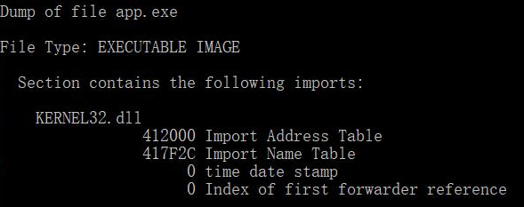

## DLL的编写与使用

base.c

```
#include<Windows.h>

// 不导出函数
int internal_function()
{
    return 0;
}
// 导出函数，需要将将函数名写入def文件
int lib_function(char* msg)
{
    // do some works
    MessageBoxA(0, "Message from base lib", msg, MB_OK);
    return 0;
}
```

exp.def

```
LIBRARY  baselib
EXPORTS
  lib_function
```

baselib.h

```
#pragma once
// 头文件方便用户使用
int lib_function(char*);
```

##### RUN TIME - 编写 EXE 文件并调用 `baselib.dll` 文件中的导出函数

app.c

```
#include <stdio.h>
#include <windows.h>

typedef int(__cdecl* MYPROC)(LPWSTR);

int main()
{
    HINSTANCE hinstLib;
    MYPROC ProcAdd;
    BOOL fFreeResult, fRunTimeLinkSuccess = FALSE;

    // Get a handle to the DLL module.
    hinstLib = LoadLibrary(TEXT("baselib.dll"));
    // baselib.dll不一定放在同一目录下，但调用的路径要保证正确

    // If the handle is valid, try to get the function address.
    if (hinstLib != NULL)
    {
        ProcAdd = (MYPROC)GetProcAddress(hinstLib, "lib_function");

        // If the function address is valid, call the function.
        if (NULL != ProcAdd)
        {
            fRunTimeLinkSuccess = TRUE;
            (ProcAdd)("Run Time: EXE call a DLL");
        }

        // Free the DLL module.
        fFreeResult = FreeLibrary(hinstLib);
    }

    // If unable to call the DLL function, use an alternative.
    if (!fRunTimeLinkSuccess)
        printf("Message printed from executable\n");
    return 0;
}
```

把`.c`文件编译为`.obj`文件：`cl.exe /c app.c`

将`app.obj`链接为`app.exe`：`link app.obj /out:app.exe`

使用URUNTIME调用方式，EXE文件的导入表中没有出现需要调用的ｂａｓｅｌｉｂ.dll文件名及函数名：

